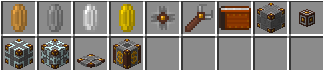

  

## Table of Contents
* [About](#about)
* [Mod-Links](#mod-links)
* [Items](#items)
* [Blocks](#blocks)

## About
ICMoney is a Minecraft mod built from CalemiUtils-1.12.2. It was built to be used solely as an economy plugin with spongeforge servers.

## Mod-Links
* [Modrinth](https://modrinth.com/project/icmoney)
* [Curseforge](https://www.curseforge.com/minecraft/mc-mods/icmoney)
* [Discord](https://discord.gg/hQyAEZV)

## Items
* Coin's, Physical Coin's.
* Gold Chip, Crafting Ingredient.
* Security Wrench, Used to access secured blocks!.
* Wallet, Used to store currency in one place..

## Blocks
* Bank, Collects money from all connected Trading Posts.s.
* Network Cable, Used to connect Trading Posts to Banks within a single network..
* Security Wrench, Used to access secured blocks.
* Network Gate, Used to enable and disable networks branches by redstone signal..
* Trading Post, Used to buy and sell blocks and items..
* Market, A server-wide market that allows you to buy and sell many items.

